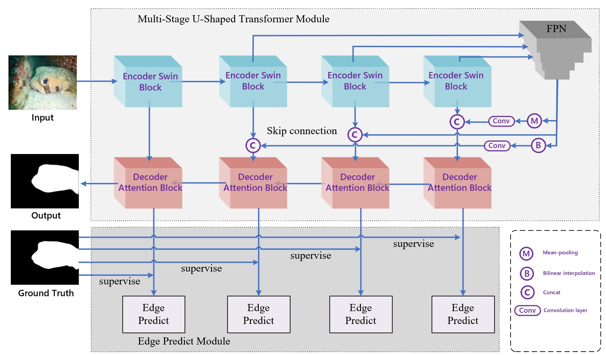
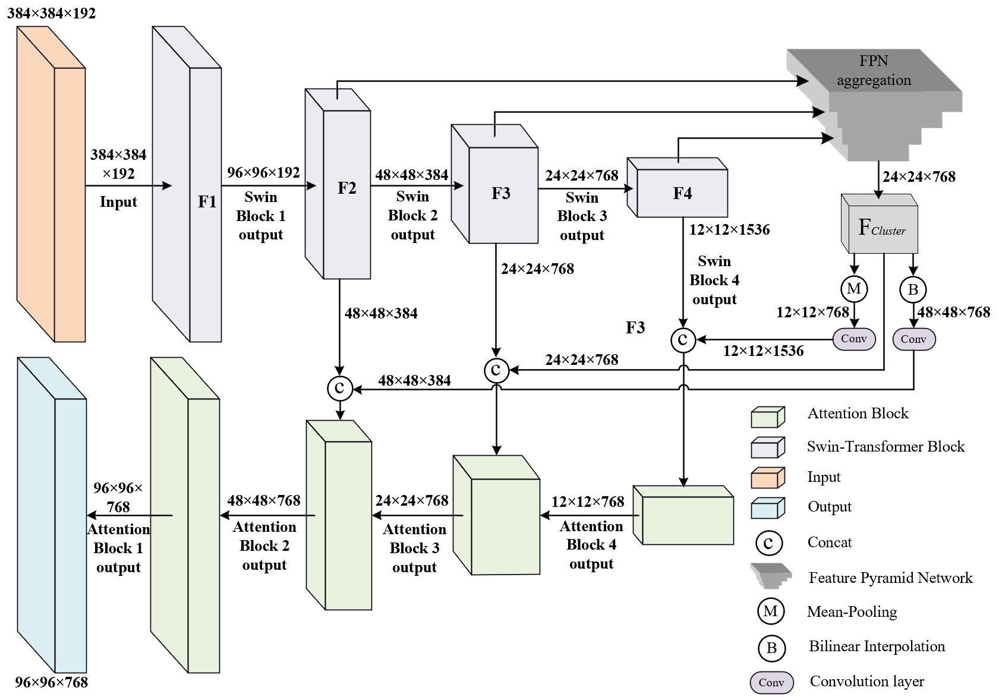
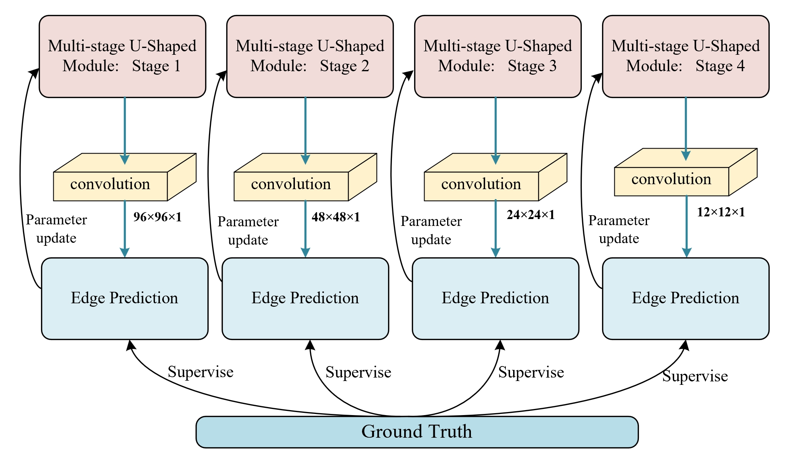

# MUT-Net

## Multi-Stage U-Shaped Transformer Network for Enhanced Image Segmentation



**MUT-Net** is a cutting-edge neural network architecture designed for precise and high-fidelity image segmentation tasks. Leveraging a multi-stage U-shaped transformer module combined with an edge prediction module, MUT-Net effectively captures multi-scale features and intricate boundary information, ensuring robust performance across various segmentation challenges.

## Table of Contents

- [Features](#features)
- [Architecture](#architecture)
  - [Overall Architecture](#overall-architecture)
  - [Multi-Stage U-Shaped Transformer Module](#multi-stage-u-shaped-transformer-module)
  - [Edge Predict Module](#edge-predict-module)
- [Loss Functions](#loss-functions)
- [Installation](#installation)
- [Usage](#usage)
  - [Training](#training)
  - [Evaluation](#evaluation)
  - [Inference](#inference)
  - [Configuration](#configuration)
- [Contributing](#contributing)
- [License](#license)
- [Acknowledgments](#acknowledgments)
- [Contact](#contact)
- [Example](#example)

## Features

- **Multi-Stage U-Shaped Transformer:** Integrates Swin Transformer encoders with Attention decoders for effective feature extraction and reconstruction.
- **Edge Prediction Module:** Enhances boundary accuracy by supervising edge predictions at each decoding stage.
- **Feature Pyramid Network (FPN):** Aggregates multi-scale features to enrich feature representation.
- **Robust Loss Functions:** Combines Focal Loss, PPA Loss, MSE Loss, and Boundary Loss for balanced and precise training.
- **Skip Connections:** Minimizes information loss and facilitates multi-level feature fusion.

## Architecture

### Overall Architecture


MUT-Net comprises two main components:

1. **Multi-Stage U-Shaped Transformer Module:** Handles feature extraction and reconstruction using a hierarchical transformer-based approach.
2. **Edge Predict Module:** Directly predicts fine edges at each decoding stage, supervised by ground truth edge data to ensure precise boundary alignment.

**Key Architectural Highlights:**

- **Multi-Stage U-Shaped Transformer:** Aggregates features from different encoding stages, enabling effective reuse of both low-level and high-level features.
- **Skip Connections:** Utilizes skip connections to preserve spatial information and enhance feature fusion.
- **Edge Supervision:** Incorporates edge prediction as an auxiliary task to improve segmentation accuracy, especially around object boundaries.

### Multi-Stage U-Shaped Transformer Module



Inspired by the U-Net architecture, this module employs the Swin Transformer as the backbone encoder to capture multi-scale and long-range dependencies effectively. The decoder uses an attention mechanism to focus on relevant features during reconstruction.

**Process Overview:**

1. **Feature Extraction:** Extracts features from the last three encoder layers and aggregates them using an FPN module.
2. **Feature Fusion:** 
   - **Upsampling:** Bilinear interpolation and convolution to match higher-resolution features.
   - **Downsampling:** Mean pooling and convolution to align with lower-resolution features.
3. **Skip Connections:** Concatenates fused features with corresponding encoder outputs to enrich feature representation.
4. **Decoder Integration:** Integrates skip connection features with main features at each decoder stage to enhance performance.

### Edge Predict Module



The Edge Predict Module enhances segmentation by focusing on object boundaries. At each decoding stage, the module predicts fine edges supervised by ground truth edge maps.

**Key Components:**

- **Convolution Layers:** Transition feature channels to the required number of classes.
- **Edge Supervision:** Ensures accurate alignment between predicted edges and actual image boundaries.
- **Parameter Update:** Uses edge prediction outcomes to refine decoder parameters, strengthening segmentation capabilities.

## Loss Functions

To ensure robust training and precise segmentation, MUT-Net employs a combination of specialized loss functions tailored for both binary and semantic segmentation tasks.


**Summary:**

- **Focal Loss & PPA Loss:** Ensure accurate classification and localization, especially in the presence of class imbalance.
- **MSE Loss:** Guarantees precise regression of object positions.
- **Boundary Loss:** Enhances the accuracy of boundary regions for detailed segmentation.

## Installation

### Prerequisites

- Python 3.7+
- PyTorch 1.7+
- CUDA 10.2+ (optional, for GPU support)

### Clone the Repository

```bash
git clone https://github.com/Swordmynew/MUT-Net.git
cd MUT-Net

### Install Dependencies

It's recommended to use a virtual environment.

```bash
pip install -r requirements.txt
